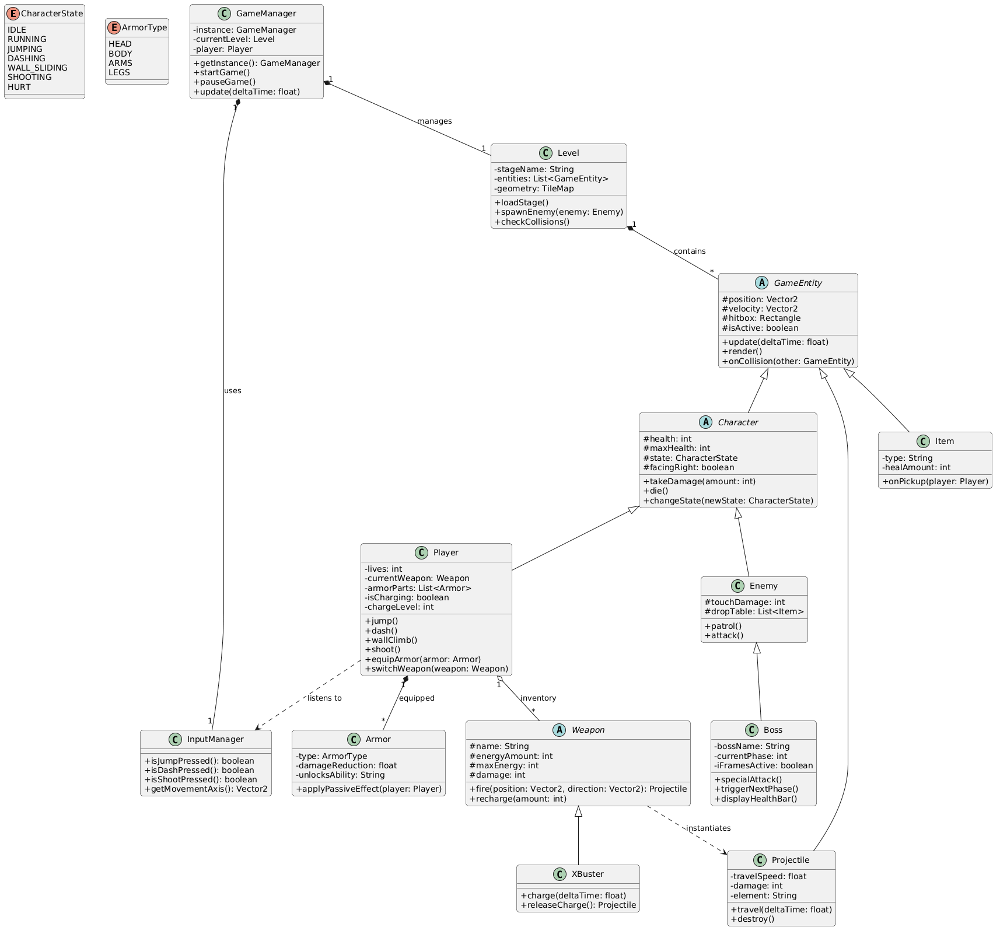
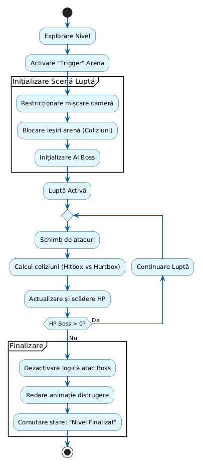
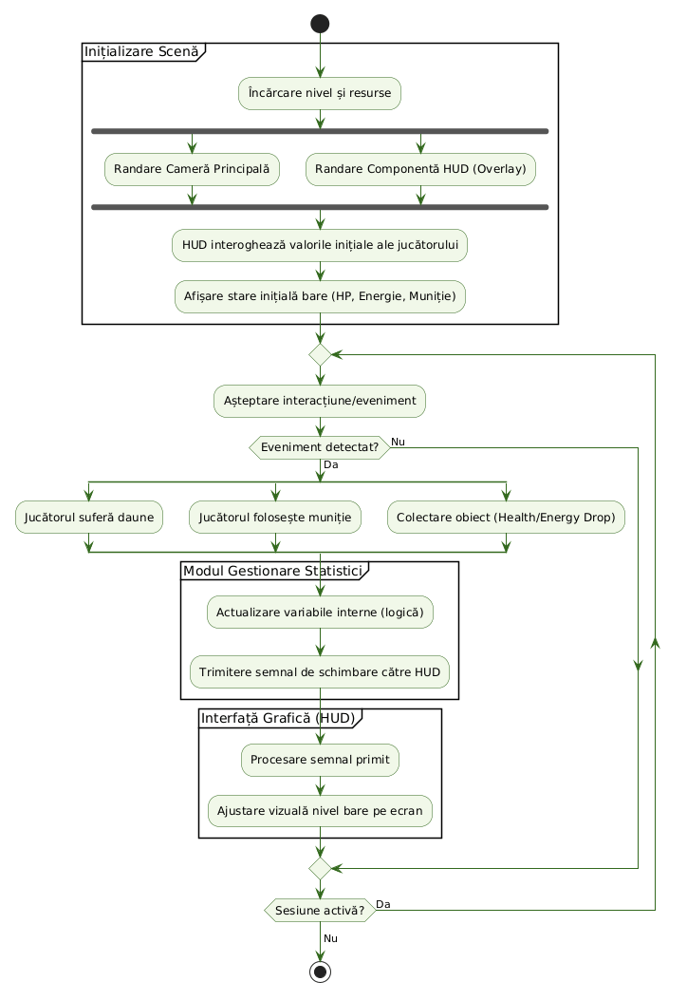
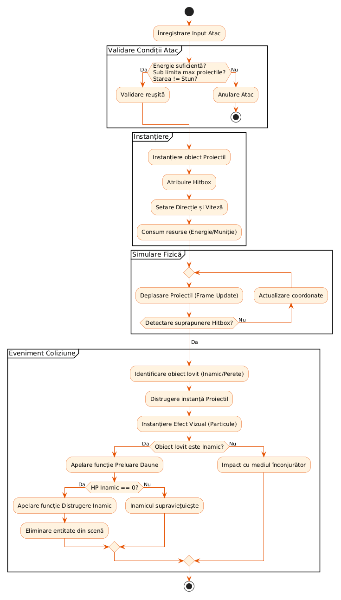
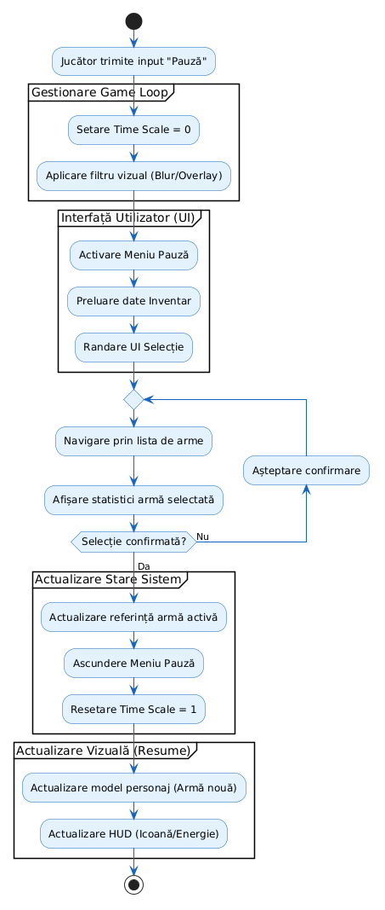

# Document de Proiectare Arhitecturală

> Fundație tehnică pentru un platformer 2D de acțiune și precizie, single-player, inspirat de jocurile de gen retro.

Acest repository conține codul sursă și documentația arhitecturală a unui joc 2D de tip platformer-shooter, dezvoltat în Godot 4.x. Scopul proiectului este recrearea fidelă a unei experiențe de joc "pure", axate pe reflexe, precizie și învățarea tiparelor inamicilor — fără mecanici RPG, crafting, arbori de abilități sau generare procedurală.

---

## Cuprins

1. [Introducere](#1-introducere)
2. [Obiective de Proiectare](#2-obiective-de-proiectare)
3. [Arhitectura Propusă](#3-arhitectura-propusă)
4. [Diagrame de Flux](#4-diagrame-de-flux)
5. [Structura Proiectului](#5-structura-proiectului)
6. [Referințe](#6-referințe)

---

## 1. Introducere

### 1.1. Scopul Sistemului

Proiectul oferă o experiență strict **single-player**, fără componente de rețea sau mecanici de tip *live-service*. Accentul cade pe mecanicile care au definit succesul genului: **reflexele**, **precizia mișcării** și **învățarea tiparelor inamicilor**, susținute de un sistem robust de detectare a coliziunilor și un arsenal modular.

Din punct de vedere tehnic, se urmărește recrearea fidelă a controlului clasic (latență minimă la Wall-Jump, Dash etc.) într-un mediu de dezvoltare modern, ceea ce permite eliminarea limitărilor hardware vechi (slowdown, limitări la numărul de obiecte) și garantarea unei experiențe fluide la **60 FPS**.

### 1.2. Definiții și Acronime

| Termen | Definiție |
|---|---|
| **Dash** | Mișcare rapidă pe orizontală |
| **Wall-Jump** | Abilitatea jucătorului de a se urca pe pereți prin sărituri succesive |
| **Hitbox** | Zona invizibilă a unui obiect care determină coliziunile |
| **Boss** | Inamic de la finalul unui nivel, mai greu de învins decât inamicii normali |
| **FPS** | Frames per second |
| **HUD** | Head-Up Display — afișaj care prezintă date critice direct în câmpul vizual al utilizatorului |
| **Parallax Scrolling** | Tehnică prin care straturile din fundal se mișcă la viteze diferite |
| **Coyote Time** | Permite săritura câteva cadre după părăsirea platformei |
| **Jump Buffering** | Înregistrarea comenzii de săritură cu câteva milisecunde înainte de aterizare |

### 1.3. Documente Referință

- *Specificația Cerințelor*

---

## 2. Obiective de Proiectare

### 2.1. Performanță — 60 FPS constanți, input latency minim

- **Separarea logicii de update.** Fizica și mișcarea (gravitație, coliziuni, sărituri) rulează exclusiv în `_physics_process(delta)` la tick-rate fix (60 Hz), pentru comportament determinist. Animațiile ne-critice rămân în `_process(delta)`.
- **Object Pooling.** Proiectilele X-Buster, inamicii de bază și particulele de explozie sunt pre-încărcate la începutul nivelului și activate/dezactivate prin `visible` și `process_mode`, în loc de `instantiate()` / `queue_free()` la runtime (evită micro-stutters).
- **Input latency redus.** Input-ul este procesat în `_unhandled_input(event)` sau la începutul ciclului `_physics_process`, garantând evaluarea acțiunilor în același frame. Hitbox-urile folosesc `RectangleShape2D` în loc de poligoane pentru calcul rapid.

### 2.2. Grafică și Estetică — Pixel-art crisp, Integer Scaling

- **Rezoluție nativă.** Definită în `Project Settings → Display → Window` pe valori care se scalează perfect (256×224 SNES sau widescreen 320×180 / 426×240).
- **Integer Scaling.** `Stretch Mode = canvas_items` / `viewport`, `Aspect = keep`, plus opțiunea explicită **Integer Scaling** — jocul se mărește doar în multipli întregi (2x, 3x, 4x), adăugând bare negre (letterboxing / pillarboxing) la nevoie.
- **Filtrarea texturilor.** Toate sprite-urile importate au `Texture Filter = Nearest` (nearest-neighbor) pentru margini "crisp".

### 2.3. Accesibilitate — Tastatură, controller, rebinding complet

- **Abstractizarea input-ului** prin `InputMap`. Codul folosește acțiuni (`Input.is_action_pressed("jump")`), nu taste hardcodate.
- **Suport nativ pentru controllere** — Godot integrează SDL2, deci Xbox / PlayStation / Switch sunt recunoscute automat.
- **Sistem de Rebinding.** Meniul ascultă primul `InputEvent` (Key sau JoypadButton), apoi `InputMap.action_erase_events()` + `action_add_event()` aplică noua mapare.
- **Persistență.** Mapările sunt salvate cu `ConfigFile` și reîncărcate la fiecare pornire.

### 2.4. Salvare de Date — Sloturi multiple, fișiere locale

- **`SaveManager` (Singleton / Autoload).** Strânge starea curentă (nivel, upgrade-uri de armură, boși învinși, vieți, E-tanks) într-un dicționar centralizat.
- **Serializare JSON** pentru debug ușor (sau `.res` binar pentru release).
- **Filesystem.** Fișierele sunt scrise în `user://` prin `FileAccess` (ex: `user://save_slot_1.json`).
- **Metadate separate.** Fiecare slot conține un obiect `metadata` (timestamp, locație, % completare) și `game_data` — meniul de Load citește doar metadatele.

---

## 3. Arhitectura Propusă

### 3.1. Stack tehnologic

| Tehnologie | Rol |
|---|---|
| **Godot Engine 4.x** | Motor grafic, game loop, randare 2D, fizică, coliziuni, UI |
| **GDScript** | Limbaj principal — sintaxă Python-like, **static typing** pentru cod robust și autodocumentat |
| **JetBrains Rider / VS Code** | IDE extern pentru refactoring, analiză statică și debugging avansat |
| **Git + GitHub/GitLab** | Control al versiunilor, branch-uri pentru funcționalități, backup în cloud |
| **JSON** | Format de serializare pentru salvări și configurări — human-readable, parser nativ în Godot |

**De ce Godot?** Open-source, lightweight, cu un motor de randare 2D dedicat (coordonate în pixeli reali, nu unități 3D abstractizate). Arhitectura bazată pe **Noduri + Scene** promovează *composition over inheritance*.

**De ce GDScript?** Limbaj nativ, dezvoltare rapidă, **static typing** (`var speed: float = 300.0`) pentru a preveni erorile la compilare.

### 3.2. Design Patterns aplicate

- **Finite State Machine (FSM)** — controlează comportamentul jucătorului și al inamicilor. Stările (`Idle`, `Run`, `Jump`, `Dash`, `Shoot`) sunt clase separate, respectând *Single Responsibility Principle*.
- **Singleton (Autoload)** — folosit pentru manageri globali: `GameManager`, `AudioManager`, `SaveManager`. O singură instanță accesibilă din orice scenă.
- **Object Pool** — pentru proiectile (X-Buster). Previne fragmentarea memoriei și spike-urile de Garbage Collection prin refolosirea instanțelor.

### 3.3. Diagrama de Clase

Schiță rapidă a ierarhiei:

- **`GameManager`** *(Singleton)* — gestionează `Level`-ul curent și `Player`-ul. Folosește `InputManager`.
- **`Level`** — conține o listă de `GameEntity`-uri, geometria (`TileMap`), gestionează spawn și coliziuni.
- **`GameEntity`** *(abstract)* — bază pentru tot ce există în scenă: `position`, `velocity`, `hitbox`, `isActive`; metode `update()`, `render()`, `onCollision()`.
- **`Character`** *(abstract)* extinde `GameEntity` cu `health`, `state: CharacterState`, `facingRight`.
  - **`Player`** — `lives`, `currentWeapon`, `armorParts`, charge state; acțiuni: `jump`, `dash`, `wallClimb`, `shoot`, `equipArmor`, `switchWeapon`.
  - **`Enemy`** — `touchDamage`, `dropTable`; comportament: `patrol`, `attack`.
    - **`Boss`** — `bossName`, `currentPhase`, `iFramesActive`; metode: `specialAttack`, `triggerNextPhase`, `displayHealthBar`.
- **`Weapon`** *(abstract)* — `name`, `energyAmount`, `damage`; metode `fire()`, `recharge()`.
  - **`XBuster`** — adăugă `charge(deltaTime)` și `releaseCharge()`.
- **`Projectile`** — `travelSpeed`, `damage`, `element`; metode `travel()`, `destroy()`.
- **`Armor`** — `type: ArmorType`, `damageReduction`, `unlocksAbility`; `applyPassiveEffect(player)`.
- **`Item`** — `type`, `healAmount`, `onPickup(player)`.
- **`InputManager`** — abstractizează input-ul: `isJumpPressed`, `isDashPressed`, `isShootPressed`, `getMovementAxis()`.

**Enumerări:**
- `CharacterState`: `IDLE`, `RUNNING`, `JUMPING`, `DASHING`, `WALL_SLIDING`, `SHOOTING`, `HURT`
- `ArmorType`: `HEAD`, `BODY`, `ARMS`, `LEGS`

---

## 4. Diagrame de Flux

### 4.1. Luptă Boss

Trigger arenă → restricționare cameră → blocare ieșiri → inițializare AI Boss → buclă (schimb de atacuri ↔ coliziuni Hitbox/Hurtbox ↔ scădere HP) → dacă `HP Boss == 0`: dezactivare logică, animație distrugere, comutare stare la *Nivel Finalizat*.

### 4.2. HUD

Inițializare scenă (încărcare nivel + randare cameră + randare HUD în paralel) → HUD interoghează valorile inițiale ale jucătorului (HP, Energie, Muniție) → buclă de evenimente (daune / muniție folosită / pickup) → Modulul de Statistici actualizează variabilele interne și trimite semnal către HUD → HUD ajustează vizual barele.

### 4.3. Meniul de Pauză și Selecția Armelor

Input "Pauză" → `Time Scale = 0` + filtru blur → activare meniu, preluare date inventar → navigare prin lista de arme + afișare statistici → selecție confirmată → actualizare referință armă activă, ascundere meniu, `Time Scale = 1` → actualizare model personaj + HUD (icoană / energie).

### 4.4. Atac

Înregistrare input atac → **Validare condiții** (energie suficientă? sub limita maximă de proiectile? `state != STUN`?) → dacă da: **Instanțiere** (proiectil + hitbox + direcție/viteză + consum resurse) → **Simulare fizică** (deplasare per frame + detectare suprapunere hitbox) → la coliziune: identificare obiect lovit (inamic / perete) → distrugere proiectil + efect vizual → dacă inamic: aplicare daune; dacă `HP == 0`: distrugere inamic și eliminare din scenă.

